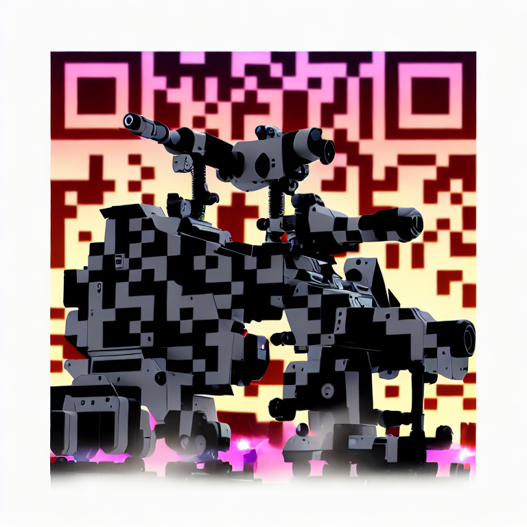

<h1 align="center">Hey there 👋, I'm Bhaswanth Ayapilla</h1>
<h2 align="center">I am passionate about Robotics, Computer Vision</h2>

<!--
- 🦾 I’m currently doing my thesis at Institute for Systems and Robotics (ISR) Lisbon in underwater robotics.
- 🔭 I also interned at MARMot Lab, NUS where I worked on multi-agent traffic signal control using reinforcement learning.
- 🌱 I’m currently building a simulator for Autonomous Underwater Gliders.
- 💻 Check out my latest work at: https://github.com/Bhaswanth-A/AUG-Simulator
- 📫 How to reach me: bhaswanthayapilla@gmail.com
- 👨‍💻 All of my projects are available at: https://bhaswanth-a.github.io/ -->

- 🏫 I’m currently pursuing my MS in Robotic Systems Development (MRSD) at Carnegie Mellon University
- :rocket: I'm working on my capstone project in Space Robotics under Dr. William "Red" Whittaker — building the [Lunar ROADSTER](https://bhaswanth-a.github.io/posts/lunar-roadster-cmu/)
- 🦾 I previously completed my undergraduate thesis at the Institute for Systems and Robotics (ISR) Lisbon in underwater robotics
- 💻 Check out my latest work at: https://github.com/Lunar-ROADSTER
- 📫 How to reach me: bhaswanthayapilla@gmail.com
- 👨‍💻 All of my projects are available at: https://bhaswanth-a.github.io/
<!--- 🔭 I also interned at MARMot Lab, NUS where I worked on multi-agent traffic signal control using reinforcement learning. -->

<!--  -->

<!--

-->

---

## 📚 My recent blog posts
<!-- BLOG-POST-LIST:START -->
- [All About Search Algorithms](https://bhaswanth-a.github.io//posts/all-about-search-algorithms/)
- [Case Studies of Planning and Decision-Making in Robotics](https://bhaswanth-a.github.io//posts/planning-case-studies/)
- [Wheeled Biped](https://bhaswanth-a.github.io//posts/wheeled-biped/)
- [Milwaukee Tool](https://bhaswanth-a.github.io//posts/milwaukee-tool/)
- [Accelerating Search-Based Planning for Multi-Robot Manipulation by Leveraging Online-Generated Experiences](https://bhaswanth-a.github.io//posts/cbs-multi-arm/)
<!-- BLOG-POST-LIST:END -->

<!-- You can also scan the QR code below to go to my website 

 -->
